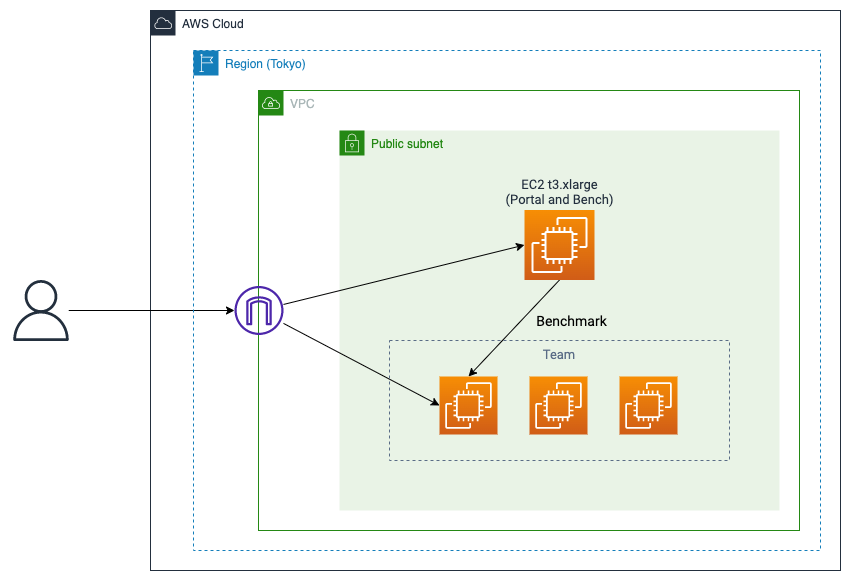

# インフラ環境の構築
## 概要
AWSを用いたインフラ環境の具体的な構築方法を説明します.
CloudFormation というJSON, YAML形式のテンプレートファイルからリソースを自動で構築するサービスがありますが, 私は書く余裕がなかったので用意していません. 余裕があれば, 是非後輩のために書いてあげてください.

## アーキテクチャ図

## 構築手順
### 1. リージョンの設定
コンソールの画面右上から, リージョンを「東京」に設定します.

### 2. ネットワークの設定
VPCダッシュボードを開き, 「VPCを作成」を押します.
ドキュメント作成時点では, 次のような画面が表示されます.

次のように設定してください. 記載のない項目はデフォルトで構いません.

- IPv4 CIDRブロック: `192.168.0.0/16`
- AZの数: 1
- プライベートサブネットの数: 0
- VPCエンドポイント: 0

プレビューは次のようになります.

### 3. インスタンスの作成
ポータル兼ベンチマーカー用インスタンスを作成します.
「AMI (EC2の機能)」を開き, **競技用のAMI**を検索します. AMI ID をクリックしてイメージの概要を開き, 右上の「AMIからインスタンスを起動」を押してください.

ネットワーク設定では

- 任意の場所からのSSHトラフィックを許可する
- インターネットからの HTTPS トラフィックを許可する
- インターネットからの HTTP トラフィックを許可する

にチェックを入れ, 新しく作成するセキュリティグループのルールを設定します. また, 2で作成したVPC, サブネットを設定してください.
さらに, 高度なネットワーク設定を開き, プライマリIPに `192.168.0.10` (実際は何でもよいです) を設定してください.
(以下のスクショはすべてデフォルト)

高度な詳細の「スポットインスタンスをリクエスト」にチェックを入れることで, 安価なスポットインスタンスと呼ばれる種類のインスタンスが起動します. テスト用のインスタンスが必要な場合に利用してください.

#### 補足
競技用のAMIでインスタンスを立てるのは, ビルド済みのベンチマーカーなどが入っていて便利だからです. また, 最近のISUCONの問題は自己署名証明書でSSL化してあることが多いので, その証明書を参照するためでもあります.
`docker-compose-prod.yml` は, `/home/isucon` をマウントするなど, 競技用インスタンスと同じディレクトリ構成となっていることを前提として書いています. (これが最適とも言えないので, いい感じに書き換えてもらって構いません)

### 4. インスタンスのパブリックIPの設定
インスタンスに固定のIPアドレスを割り当てます. (自動割り当ての場合, 再起動のたびにIPアドレスが変わります)
「Elastic IP (EC2の機能)」を開き, 「Elastic IP アドレスを割り当てる」からデフォルトの設定で割り当てを行ってください.

作成したIPアドレスを選択し, 「Elastic IP アドレスの関連付け」から, 3で作成したインスタンスにIPアドレスを設定してください.

## 注意
リソースの利用内容に応じて料金が発生します. 料金体系をよく確認し, 費用を抑える工夫を行ってください.

## Links
- [AWS - CloudFormation](https://docs.aws.amazon.com/ja_jp/AWSCloudFormation/latest/UserGuide/Welcome.html)
- [AWS - スポットインスタンス](https://aws.amazon.com/jp/ec2/spot/)
- [AWS - EC2 オンデマンド料金](https://aws.amazon.com/jp/ec2/pricing/on-demand/)